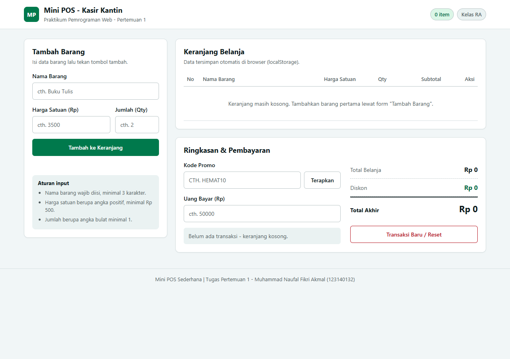
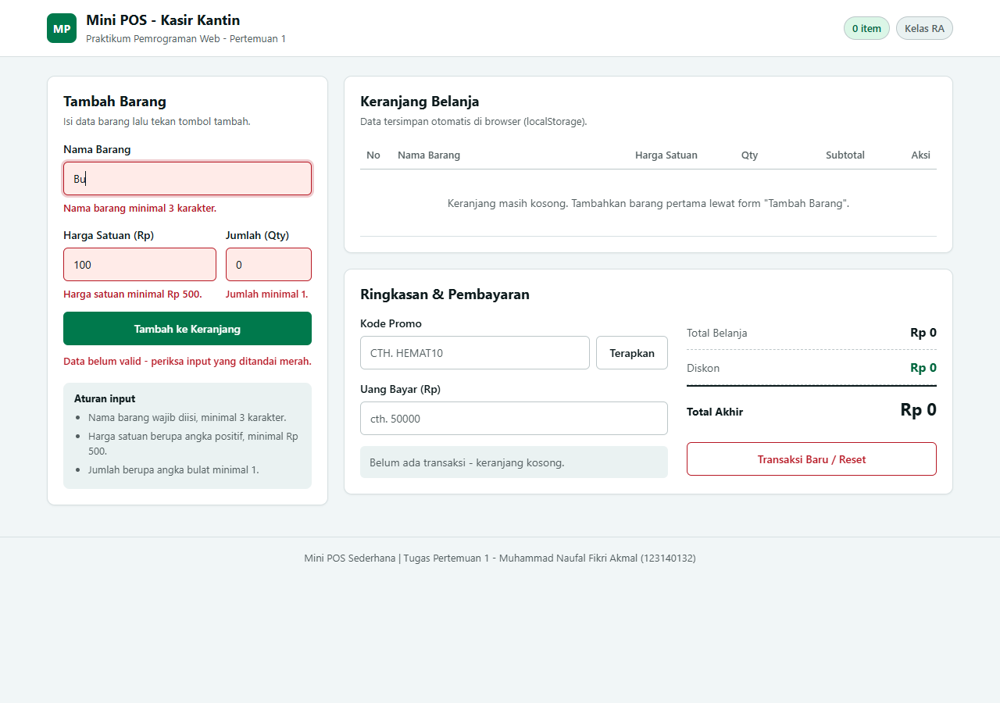
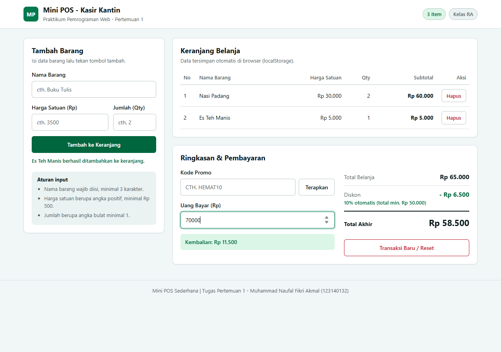

# Mini POS - Kasir & Keranjang Belanja Sederhana

Aplikasi kasir (Point of Sale) sederhana untuk kasir kantin / toko kampus, dikerjakan sebagai tugas **Praktikum Pemrograman Web - Pertemuan 1 (JavaScript Dasar)**.

## Identitas

| | |
|---|---|
| Nama Lengkap | Muhammad Naufal Fikri Akmal |
| NIM | 123140132 |
| Kelas Praktikum | RA |
| Repository GitHub | `pemrograman_web_itera_123140132` |

## Deskripsi Aplikasi

**Mini POS** adalah aplikasi web kasir yang memungkinkan kasir menambahkan barang belanjaan ke dalam keranjang, melihat perhitungan belanja secara otomatis, menerapkan diskon, dan menghitung kembalian pembayaran - semuanya tanpa server, hanya HTML, CSS, dan JavaScript murni.

**Tujuan pembuatan:**

1. Menerapkan **validasi input form** dengan pesan error yang jelas di bawah input yang salah.
2. Membangun **kalkulator otomatis** (subtotal per baris, total belanja, diskon, uang kembalian).
3. Mengelola **daftar keranjang belanja persisten** menggunakan `localStorage` (`JSON.stringify` / `JSON.parse`).

**Studi kasus:** kantin / toko kampus di mana kasir memasukkan nama barang, harga satuan, dan jumlah, lalu sistem menghitung total, diskon, dan kembalian secara otomatis. Keranjang tidak hilang saat halaman di-refresh dan dikosongkan lewat tombol **Transaksi Baru** setelah transaksi selesai.

## Panduan Menjalankan

1. Clone atau unduh repository ini, lalu buka foldernya di **VS Code**:
   ```
   git clone https://github.com/MNAUFALFAKMAL/pemrograman_web_itera_123140132.git
   ```
2. Pasang ekstensi **Live Server** (Ritwick Dey) jika belum ada.
3. Buka file `index.html`, klik kanan -> **Open with Live Server**.
4. Aplikasi terbuka di browser (mis. `http://127.0.0.1:5500/index.html`).
5. **Alternatif tanpa Live Server:** klik dua kali `index.html` langsung di File Explorer.

> Tips: buka DevTools (**F12**) -> tab **Application** -> **Local Storage** untuk memantau data keranjang yang tersimpan.

## Daftar Fitur

### 1. Validasi Form Input Barang

- [x] Nama barang wajib diisi, **minimal 3 karakter**
- [x] Harga satuan wajib berupa **angka positif minimal Rp 500** (tolak 0, negatif, teks kosong)
- [x] Jumlah/qty wajib berupa **angka bulat minimal 1**
- [x] Pesan peringatan **merah di bawah input** yang salah + `aria-invalid`
- [x] Barang **tidak masuk keranjang** jika data tidak valid
- [x] Form **otomatis di-reset** dan input nama difokuskan kembali jika berhasil
- [x] Error divalidasi ulang secara live saat pengguna memperbaiki input

### 2. Kalkulator & Perhitungan Otomatis

- [x] **Subtotal per baris** = Harga Satuan x Qty (hitung otomatis)
- [x] **Total belanja** = jumlah seluruh subtotal, terhitung ulang setiap perubahan keranjang
- [x] **Diskon otomatis 10%** jika total minimal Rp 50.000
- [x] **Kode promo `HEMAT10`** -> diskon 10% (tidak ditumpuk dengan diskon otomatis)
- [x] Nominal diskon dan **total akhir** ditampilkan (keterangan sumber diskon ikut tampil)
- [x] **Kalkulator uang bayar**: Kembalian = Uang Bayar - Total Akhir, dihitung saat mengetik
- [x] Jika uang kurang, tampil peringatan **"Uang belum mencukupi - kurang Rp ..."**

### 3. Manajemen Keranjang & LocalStorage

- [x] Tabel keranjang: **No, Nama Barang, Harga Satuan, Qty, Subtotal, Aksi**
- [x] Tombol **Hapus** di setiap baris -> total & diskon langsung terhitung ulang
- [x] Data disimpan ke `localStorage` dengan **`JSON.stringify()`** dan dimuat dengan **`JSON.parse()`**
- [x] Keranjang **tetap ada setelah refresh** halaman
- [x] Tombol **Transaksi Baru / Reset** mengosongkan keranjang + membersihkan `localStorage`
- [x] Empty state yang informatif saat keranjang kosong

### 4. Antarmuka (UI/UX)

- [x] Tata letak dua kolom ala POS: form di kiri, keranjang & ringkasan di kanan
- [x] Format **Rupiah konsisten** (`Intl.NumberFormat`) dan kolom angka rata kanan
- [x] Responsif (1 kolom untuk layar 920px ke bawah), fokus keyboard terlihat, hormati `prefers-reduced-motion`

## Tangkapan Layar

### 1. Tampilan form input utama (keranjang kosong)



### 2. Validasi error (nama < 3 karakter, harga < Rp 500, qty < 1)



### 3. Hasil perhitungan kalkulator & tabel keranjang



Pada screenshot 3: total belanja **Rp 65.000**, diskon otomatis 10% **Rp 6.500** (total minimal Rp 50.000), total akhir **Rp 58.500**, uang bayar Rp 70.000 -> kembalian **Rp 11.500**.

## Penjelasan Teknis Singkat

### 1. Penanganan validasi input

Setiap field memiliki fungsi validasi sendiri (`validasiNamaBarang`, `validasiHarga`, `validasiJumlah`) yang **membalikkan string pesan error** jika tidak valid, atau `""` jika valid. Saat form di-`submit`, `preventDefault()` mencegah reload, lalu ketiga fungsi dijalankan dan hasilnya ditampilkan lewat `tampilkanError()` (mengubah teks `<p class="error">`, menambah class `is-invalid`, dan atribut `aria-invalid`).

Jika **ada satu pun error**, handler langsung `return` - barang tidak pernah masuk array keranjang - dan fokus dikirim ke input pertama yang salah. Jika semuanya valid, data di-`push` ke array, `render()` dijalankan, lalu `form.reset()` mengosongkan input. Error juga divalidasi ulang pada event `input` sehingga pesan hilang begitu pengguna memperbaiki isinya.

### 2. Algoritma kalkulator keuangan

```
Subtotal baris  = harga * jumlah                        (hitungSubtotal)
Total belanja   = jumlah seluruh subtotal              (reduce)
Diskon          = (total >= 50.000 ATAU promo HEMAT10) ? round(total * 10%) : 0
Total akhir     = total belanja - diskon
Kembalian       = uang bayar - total akhir
```

Semua fungsi murni (input -> output) sehingga mudah diuji. `renderRingkasan()` dan `renderPembayaran()` dipanggil setiap kali ada perubahan (tambah/hapus barang, terapkan promo, mengetik uang bayar), sehingga total, diskon, dan kembalian **selalu sinkron**. Jika `uang bayar < total akhir`, status berubah menjadi peringatan merah "Uang belum mencukupi - kurang Rp ...".

### 3. Mekanisme serialisasi localStorage

- **Menyimpan:** `simpanKeranjang()` -> `localStorage.setItem(KEY, JSON.stringify(keranjang))` - array objek keranjang diubah menjadi string JSON.
- **Memuat:** `muatKeranjang()` -> `localStorage.getItem(KEY)` lalu `JSON.parse()`, dibungkus `try/catch` agar data korup / storage kosong tidak membuat aplikasi crash (fallback `[]`).
- **Merendam:** `transaksiBaru()` -> `localStorage.removeItem(KEY)` + `form.reset()` sehingga data benar-benar bersih untuk transaksi berikutnya.
- Pemanggilan `simpanKeranjang()` terjadi di setiap aksi tambah/hapus, sehingga penyimpanan selalu sinkron dengan tampilan tabel.

## Struktur Folder

```
muhammadnaufalfikriakmal_123140132_pertemuan1/
|-- index.html        # Struktur HTML aplikasi
|-- style.css         # Styling CSS antarmuka (desain hijau emerald, 2 kolom)
|-- script.js         # Logika JavaScript (validasi, kalkulator, localStorage)
|-- README.md         # Dokumentasi ini
|-- screenshot/       # Tangkapan layar untuk dokumentasi
|   |-- 01-form-input-utama.png
|   |-- 02-validasi-error.png
|   `-- 03-kalkulator-tabel.png
`-- modul/            # File latihan selama mengikuti materi praktikum
    |-- README.md
    |-- 01_variabel_kondisional.html / .js
    |-- 02_loop_fungsi.html / .js
    |-- 03_array_objek.html / .js
    `-- 04_dom_api.html / .js
```

## Modul Latihan

File latihan per topik materi Pertemuan 1 ada di folder [`modul/`](modul/README.md): Variabel & Kondisional, Loop & Fungsi, Array & Objek, serta DOM & API.
